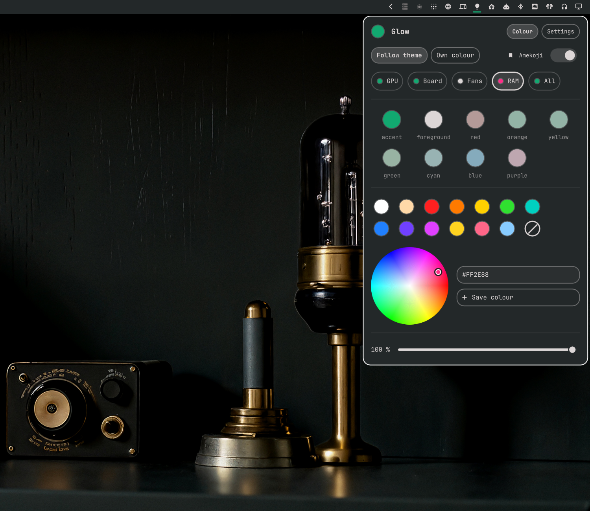
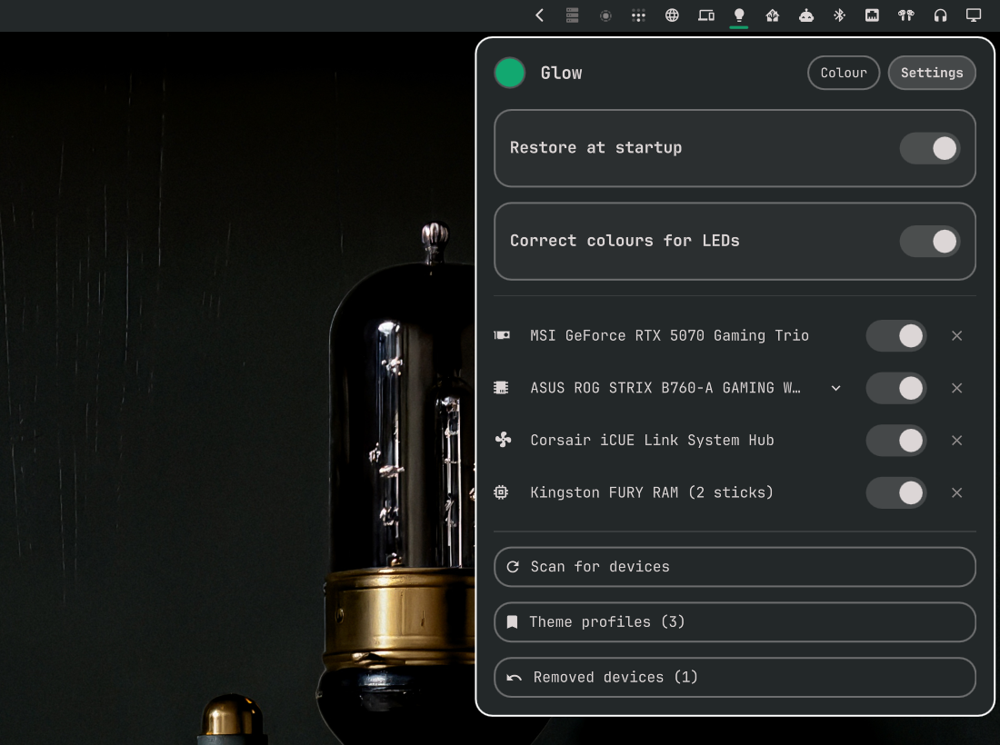
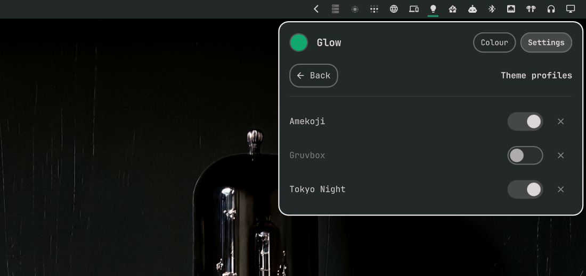

# Omaglow

An Omarchy bar plugin that sets the colour of your RGB hardware. You can pick
a colour yourself or let the hardware follow the Omarchy theme.

## Features

- Follow theme. The hardware uses the colours of the current theme and is
  repainted when you switch theme.
- Own colour. Fixed colours from a colour wheel, a hex field, presets and
  colours you save yourself.
- One colour for all devices, or a separate colour per device. Select All to
  change everything, or select a device to change only that one.
- In Follow theme each device remembers which theme colour it uses, for
  example accent on the RAM and foreground on the rest. That stays the same
  when the theme changes.
- A device can also have a fixed colour while the rest follow the theme.
- Theme profiles. Switch to a theme, adjust the colours and press the
  bookmark. That theme now has its own look. The switch next to the theme
  name turns the profile off without deleting it.
- Turn a device off with the crossed out circle.
- Brightness, and an optional colour correction for LEDs.
- Settings are saved and restored at login.

Left click opens the panel. Right click switches between Follow theme and Own
colour.

## Supported hardware

Everything OpenRGB can set to a single colour. That covers most GPUs,
motherboards, fan hubs, coolers, keyboards, mice and LED strips.

Kingston FURY DDR5 RGB memory is handled directly over SMBus. OpenRGB cannot
detect it on motherboards that block SPD page switching.

## Install

    omarchy pkg add openrgb i2c-tools
    omarchy plugin add https://github.com/Gabbe2312/omaglow.git --enable

Open the panel and press Set up. This does the following:

- Runs one full OpenRGB detection and disables the detectors that found
  nothing. The config is stored in `~/.config/omarchy/omaglow/openrgb`. Your
  normal OpenRGB config is not changed.
- Starts `omaglow-openrgb.service`, an OpenRGB server that only listens on
  `127.0.0.1`. It uses about 15 MB of memory.
- Enables `omaglow-apply.service`, which restores your colours at login.
- Installs a `theme-set` hook that repaints the hardware on theme changes.

Run `bin/omaglow teardown` to remove all of this again.

The server is needed because some devices, for example the Corsair iCUE LINK
hub, go back to their default lighting as soon as the controlling program
exits.

## Settings

- Restore at startup. When off, nothing runs at login. The server starts the
  first time you open the panel or change theme.
- Correct colours for LEDs. On by default.
- A switch per device. Devices that are off are not touched.
- A cross per device removes it. Use this for devices OpenRGB detects wrongly.
  Some wireless receivers reuse a USB id from another product and get detected
  as that product. Removed devices can be restored from the same tab.
- Motherboards with addressable headers get an arrow that shows the headers.
  Set the number of LEDs on each strip, otherwise the strip stays dark.
- Theme profiles lists your profiles. Each has a switch and a delete button.
- Scan for devices looks for new hardware.

## Limitations

- One colour per device. No effects and no per LED colours.
- RAM other than Kingston FURY DDR5 goes through OpenRGB. If your motherboard
  blocks SPD page switching, OpenRGB may not find DDR5 modules. Setting
  "SPD Write Disable" to false in the BIOS usually fixes that. Kingston FURY
  DDR4 also goes through OpenRGB.
- Devices without any static colour mode are not listed.
- Off means black. A device that glows when set to black will still glow.
- Before login the hardware uses its own lighting.
- Tested on one machine with an MSI GPU, an ASUS Aura motherboard, a Corsair
  iCUE LINK hub and Kingston FURY DDR5. Reports from other hardware are
  welcome.

## Security

- The OpenRGB server listens on `127.0.0.1` only. The OpenRGB SDK has no
  authentication, so it should never be reachable from the network.
- The helper does not make network connections and does not need root. Device
  access comes from the udev rules in the `openrgb` package.
- SMBus writes only go to addresses that belong to a DDR5 slot reported by the
  kernel, and only after a controller has answered with the FURY signature. On
  some boards one slot returns garbage for the signature after a cold boot. That
  slot is accepted if another slot on the same bus has a valid signature.
- A lock file stops the theme hook and the panel from writing at the same time.

## Command line

    omarchy-shell io.github.gabbe2312.omaglow color "#ff7a00"
    omarchy-shell io.github.gabbe2312.omaglow follow on

    bin/omaglow status
    bin/omaglow set brightness 60
    bin/omaglow device-color fury theme:accent

Run `bin/omaglow help` for the full list.

## Development

    python3 -m unittest discover tests

The tests replace the hardware calls with recorders. For testing the panel
from a script there are a few extra IPC calls: `state`, `select`, `pick` and
`pickKey`.

## License

MIT
